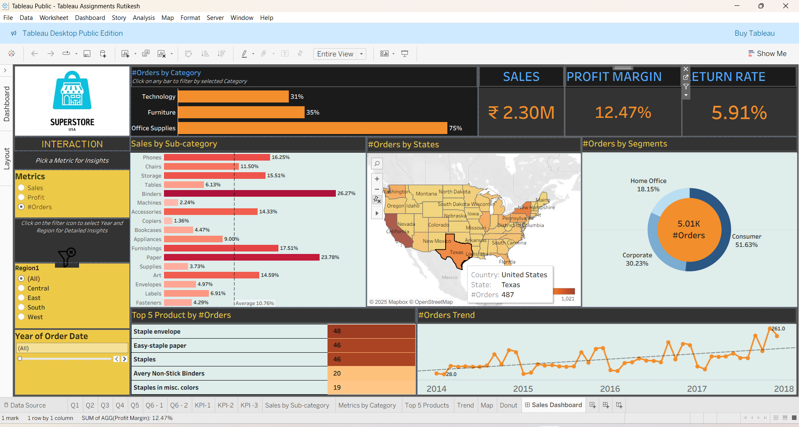

# Task 8 ElavateLab - Rutikesh Pawar

This repository contains my Tableau assignments and related resources completed as part of my Data Analytics learning journey.

---

## 📷 Project Screenshot
Here’s a preview of my Tableau work:

---

## 📂 Files in this Repository

- **README.md** → Overview and description of the repository.
- **Sss.png** → Screenshot/image of my Tableau dashboard.
- **TASK 8 DA.pdf** → PDF document containing Task 8 for Data Analytics.
- **Tableau Assignments Rutikesh.twbx** → Tableau packaged workbook containing my completed Tableau visualizations and dashboards.

---

## 📊 Project Overview

The Tableau workbook includes:
- Data visualization dashboards
- Interactive charts and graphs
- Assignment tasks demonstrating various Tableau features

---

## 🛠 Tools & Technologies Used
- Tableau
- Microsoft Excel (data source)
- PDF for task documentation
- PNG images for visualization snapshots

---

## 📥 How to Use
1. Download the `.twbx` file from the repository.
2. Open it in **Tableau Desktop** or **Tableau Public**.
3. Explore the dashboards and worksheets.

---

📌 **Author**: Rutikesh Pawar  
📅 **Created**: 2025  
