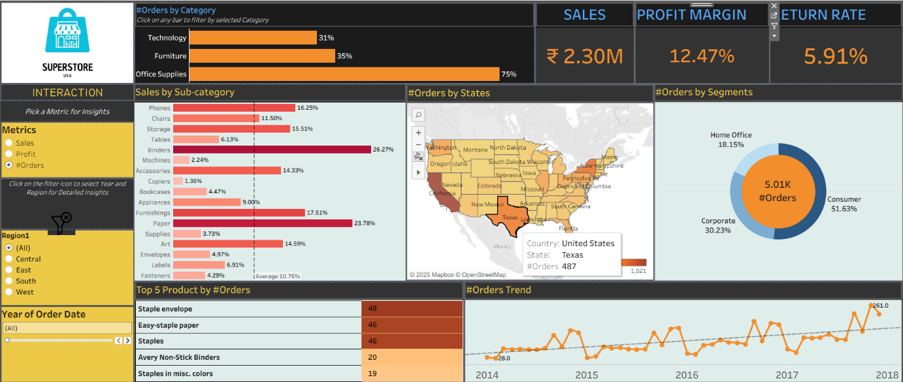

# Task 8 ElavateLab - Rutikesh Pawar

# 📊 Superstore Sales Analysis - Tableau Dashboard

This repository contains my Tableau dashboard and related resources for **Superstore Sales Analysis**.  
The project visualizes and analyzes sales, profit margins, return rates, and order trends across categories, states, and segments.

---

## 📷 Dashboard Preview
Here’s a preview of the Tableau dashboard:

---

## 📝 Project Description

The **Superstore Sales Analysis** project is designed to provide key insights into store performance.  
The dashboard includes:
- **Sales by Category & Sub-Category** – Breakdown of sales distribution across product categories.
- **KPIs** – Sales (₹), Profit Margin (%), and Return Rate (%).
- **Orders by State** – Geographic view of order distribution.
- **Orders by Segment** – Share of orders from Consumer, Corporate, and Home Office segments.
- **Top 5 Products by Orders** – Products with the highest demand.
- **Orders Trend Over Time** – Monthly/Yearly trend analysis.

The dashboard allows **interactive filtering** by:
- Metric type (Sales, Profit, Orders)
- Region
- Year of Order Date

---

## 📂 Files in this Repository

- **README.md** → Overview and description of the repository.
- **Sss.png** → Screenshot of the Tableau Superstore Sales Dashboard.
- **TASK 8 DA.pdf** → PDF document for Data Analytics Task 8.
- **Tableau Assignments Rutikesh.twbx** → Tableau packaged workbook containing the complete dashboard.

---

## 🛠 Tools & Technologies Used
- **Tableau** – Data visualization and dashboard creation.
- **Microsoft Excel** – Data source for analysis.
- **PNG** – Snapshot of the final dashboard.
- **PDF** – Task documentation.

---

## 📥 How to Use
1. Download the `.twbx` file from the repository.
2. Open it in **Tableau Desktop** or **Tableau Public**.
3. Interact with filters to explore insights.

---

📌 **Author**: Rutikesh Pawar  
📅 **Created**: 2025
